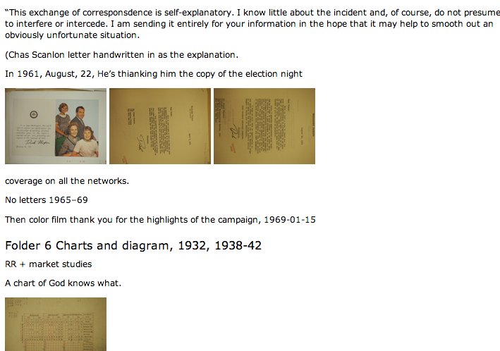

Archive Logger
===========

This is an ad-hoc solution for a common problem for historians:
synchronizing archival photos with notes.
It's terrible to come back
from the archives with hundreds of unlabeled
photos, alongside typed-up notes that (sometimes) reference things being
"photographed,"
without any convenient interface between the two.
This puts photos directly into the part of your 
notes they describe. 
As long as you take even cursory notes (writing the name of each box and folder as you
open it), you'll have the necessary information for citation straight out of your notes 
by reading them in a web browser.

Example Image
-------------

Here's what it looks like in the end. 
I took some notes on the "Nixon correspondence" folder, and then snapped a picture of the 1962 (?) Nixon family Christmas card. Then I moved on to a new folder and took a picture of a new image. The program neatly deposits the images just below whatever notes I took. (Technically, it deposits thumbnails: then you click to see the full image.)

----------------------------------

----------------------------------

This solves that problem by using a
constantly-updated git repository to track the exact time that each
line was edited, and exif metadata stored in camera files to
track the time each picture was taken.

For each photo you've taken, it finds the lines edited most closely in
time, and drops a thumbnail in beside them with a link to your
full-size archival photo so you can see what photos go with what notes.

It may be adaptable for others who, like me, are:

1. Compulsive savers of documents (several times a minute), or
willing to script something for your editor that will make you one.
2. Taking archival notes in markdown or some other plain-text format.

It's currently set up to work with a gitit installation, because I was
trying that out in my last archival trip; but any any other markdown
to html flow for browsing your notes would work reasonably well. The
script `matchPhotos.py` has variables that define where pictures are stored and
how the HTML links should be prefixed that may require some fooling
with: there's a --dry-run option when you run to make this easier.

Since the whole thing relies on version control, there's no risk of
irreparably messing up your notes in the save version by trying it;
you can just check out one of the old commits if something goes wrong.

Usage
=====

In the archives
-----------------------

1. Synchronize your computer and camera clocks.
2. Put the directory with your markdown notes under version
control. (Run `git init` in it, basically, if you haven't already).
3. Run `./commit` (or `perl commit`), changing the filenames inside to reflect your 
   own directory name, and keep it running: this will continuously commit your
   changes to the git archive in the repository.
4. Type in notes and take photographs as you normally
would:^[Except for the warnings below] save your
files often, at the very least every time you put down or pick up your camera.

At home
-------------

1. Put the photos from your camera into the photo directory defined in
the options section of `matchPhotos.py`.
2. Run `matchPhotos.py`. 
3. Compile your markdown to html; there should now be thumbnails that
link to full pictures in your notes.

Dependencies
===========

1. `leveldb` and its python module to cache exif descriptions and
lists of photos that have already been assigned to documents.
2. GitPython. But, ridiculously, not the main repository, which has a bug: you have
to check out and install
[vitalif's fork](https://github.com/vitalif/GitPython) at the moment
to get a patch for a problem with the main trunk's version of `git
blame`. Just type `make GitPython` and this will all happen for
you. At some point there should be another release of GitPython which
you can just use.

Warnings
========

This will break under some circumstances, so I'd only do this
supplementally to however you usually track photos. (Although, if
you're like most historians, that may be nothing at all).

Among the things that will break it:

1. It uses the **present state** of the text (`git blame`) to
determine which lines were edited, so if you edit a line but then
change it again an hour later, the script won't know that line
should have a photo tagged to it. (Inserting the commits back into the
history directly would be nice, but I can't quite figure out how to do
all the conflict resolution.) There are a lot of things that might do
this: I happen not to do most in the archives. Things that might change a line, and
therefore make it invisible to you history, include:
	* A universal find-replace
	* Spell check
	* Group-indenting a batch of lines.

2. If you don't save constantly, strange things may happen. A sudden
jump from paragraph 88 to paragraph 20, for instance, may
result in some pictures that you intended to follow paragraph 88
instead being put before paragraph 20. The solution to this is to save
more often. (Even if its just a couple returns at the end of the section you just finished.)

3. If the process that constantly commits to git stops, it won't know
where to put them. (Obviously).

4. Your camera clock and computer clock must be synchronized. If they're off by a minute, the photos may go into the wrong folder.

That said, it's worked seamlessly for me so far.
